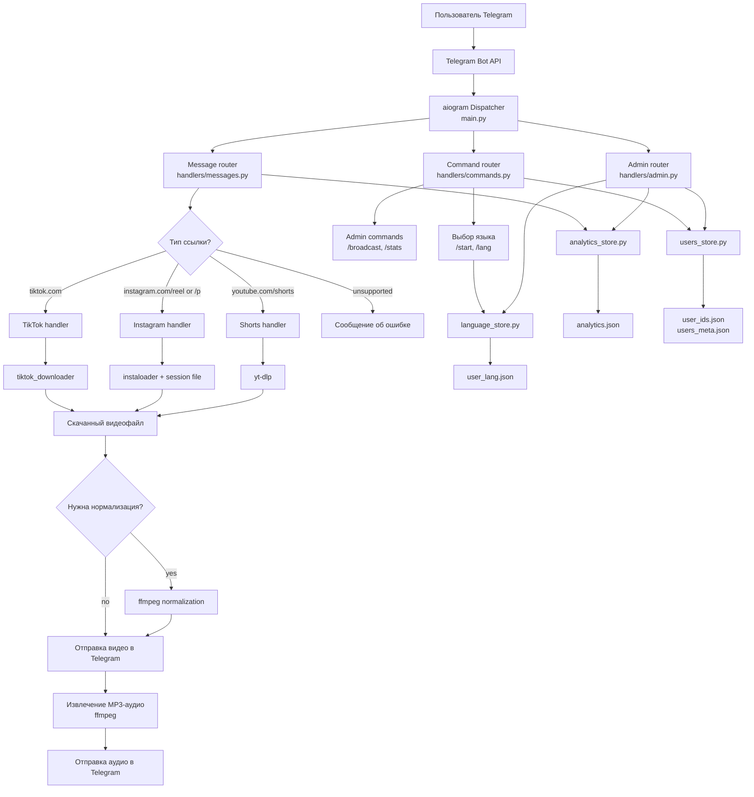

# Telegram Bot Reels and TikTok Downloader


Telegram-бот для скачивания видео и извлечения аудио из TikTok, Instagram Reels/posts и YouTube Shorts.

Бот работает через Telegram long polling: принимает сообщения от пользователей, определяет поддерживаемые ссылки, скачивает медиа, при необходимости нормализует видео, извлекает MP3-аудио, отправляет результат обратно пользователю и сохраняет легкую JSON-аналитику для админ-панели.

## Возможности

- Скачивание видео по ссылкам TikTok.
- Скачивание видео из Instagram Reels и Instagram posts.
- Скачивание YouTube Shorts через `yt-dlp`.
- Извлечение аудио из скачанного видео и отправка в формате MP3.
- Нормализация видео через `ffmpeg` для более стабильного воспроизведения в Telegram.
- Интерфейс на двух языках: русский и English.
- Выбор языка отдельно для каждого пользователя.
- Админ-панель со списком пользователей, статистикой платформ, последними ссылками и топом пользователей.
- Команда рассылки для администраторов.
- Локальное хранение данных в JSON без внешней базы данных.
- Удобный деплой на VPS через `PM2`.

## Технологии

| Слой | Технология |
| --- | --- |
| Bot framework | `aiogram 3.4.1` |
| Config | `python-dotenv` |
| TikTok downloader | `tiktok_downloader` |
| Instagram downloader | `instaloader` |
| YouTube Shorts downloader | `yt-dlp` |
| Video/audio processing | `ffmpeg`, `ffprobe` |
| Storage | JSON files |
| Process manager | `PM2` |

## Структура проекта

```text
.
├── main.py                    # Точка входа: создает Bot/Dispatcher и запускает polling
├── config.py                  # Переменные окружения и проверка админов
├── texts.py                   # Тексты бота на разных языках
├── handlers/
│   ├── commands.py            # /start, /lang, /broadcast, /stats
│   ├── messages.py            # Маршрутизация ссылок и callback выбора языка
│   ├── admin.py               # Inline admin panel
│   ├── ui.py                  # Общие UI helpers
│   └── media/
│       ├── tiktok.py          # Сценарий обработки TikTok
│       ├── instagram.py       # Сценарий обработки Instagram
│       └── shorts.py          # Сценарий обработки YouTube Shorts
├── services/
│   ├── tiktok.py              # Сервис скачивания TikTok
│   ├── instagram.py           # Сервис скачивания Instagram
│   ├── shorts.py              # Сервис скачивания YouTube Shorts
│   └── media_utils.py         # Helpers для ffmpeg/ffprobe
├── storage/
│   ├── users_store.py         # ID пользователей и метаданные
│   ├── language_store.py      # Языковые настройки пользователей
│   └── analytics_store.py     # Аналитика ссылок и статистика админки
└── requirements.txt
```

## Архитектура



## Как это работает

1. Бот запускается из `main.py`: создается `aiogram.Bot`, регистрируются routers, загружаются JSON-файлы и стартует long polling.
2. Когда пользователь отправляет `/start`, бот сохраняет его данные и предлагает выбрать язык, если язык еще не выбран.
3. Когда пользователь отправляет обычное сообщение, `handlers/messages.py` проверяет, является ли оно поддерживаемой ссылкой.
4. Ссылка отправляется в нужный media handler:
   - TikTok: `handlers/media/tiktok.py`
   - Instagram: `handlers/media/instagram.py`
   - YouTube Shorts: `handlers/media/shorts.py`
5. Handler вызывает сервис из папки `services/`, который скачивает видео.
6. Для TikTok и Instagram бот может нормализовать видео через `ffmpeg`, если Telegram может некорректно его отображать.
7. Бот отправляет пользователю видео, затем извлекает MP3-аудио и отправляет аудио отдельным сообщением.
8. Временные медиафайлы удаляются после обработки.
9. Каждое событие по ссылке записывается в `analytics.json`, чтобы админ-панель могла показывать статистику и последние действия.

## Файлы хранения данных

Бот использует простые JSON-файлы в корне проекта:

| Файл | Назначение |
| --- | --- |
| `user_ids.json` | Список известных Telegram user IDs |
| `users_meta.json` | Usernames, first names и last names |
| `user_lang.json` | Выбранный язык для каждого пользователя |
| `analytics.json` | История ссылок, счетчики платформ, success/fail статистика |
| `ig_session` | Instagram session file для `instaloader` |

Это runtime data. Если переносишь бота на VPS или обновляешь проект, сохрани эти файлы, чтобы не потерять пользователей, языковые настройки, Instagram-сессию и аналитику.

## Переменные окружения

Создай файл `.env` в корне проекта:

```env
BOT_TOKEN=your_telegram_bot_token
IG_USERNAME=your_instagram_username
IG_SESSIONFILE=ig_session
ADMIN_ID=123456789
```

Можно указать несколько администраторов:

```env
ADMIN_IDS=123456789,987654321
```

`ADMIN_ID` и `ADMIN_IDS` можно использовать вместе.

## Локальный запуск

```bash
git clone https://github.com/paxanraul/Telegram-Bot-Reels-and-TikTok-download-.git
cd Telegram-Bot-Reels-and-TikTok-download-

python3 -m venv venv
source venv/bin/activate
pip install -r requirements.txt

nano .env
python3 main.py
```

Перед запуском добавь нужные переменные окружения в `.env`.

## Деплой на VPS через PM2

Установи системные зависимости:

```bash
sudo apt update
sudo apt install -y git python3 python3-venv python3-pip ffmpeg nodejs npm
sudo npm install -g pm2
```

Склонируй проект:

```bash
git clone https://github.com/paxanraul/Telegram-Bot-Reels-and-TikTok-download-.git
cd Telegram-Bot-Reels-and-TikTok-download-
```

Создай virtual environment:

```bash
python3 -m venv venv
source venv/bin/activate
pip install -r requirements.txt
```

Создай `.env`:

```bash
nano .env
```

Запусти бота через `PM2`:

```bash
pm2 start main.py --name video-bot --cwd "$(pwd)" --interpreter "$(pwd)/venv/bin/python"
pm2 save
pm2 startup
```

После `pm2 startup` PM2 выведет дополнительную команду вида `sudo env PATH=...`. Скопируй ее, выполни, и бот будет автоматически запускаться после перезагрузки VPS.

Полезные команды `PM2`:

```bash
pm2 status
pm2 logs video-bot
pm2 restart video-bot
pm2 stop video-bot
pm2 delete video-bot
```

## Админ-команды

| Команда | Описание |
| --- | --- |
| `/admin` | Открывает inline admin panel |
| `/stats` | Показывает сохраненных пользователей |
| `/broadcast text` | Отправляет сообщение всем сохраненным пользователям |

Админ-команды доступны только пользователям из `ADMIN_ID` или `ADMIN_IDS`.

## Команды пользователя

| Команда | Описание |
| --- | --- |
| `/start` | Запускает бота и показывает выбор языка |
| `/lang` | Меняет язык интерфейса |

Для скачивания пользователю достаточно отправить поддерживаемую ссылку.

## Поддерживаемые ссылки

| Платформа | Примеры URL |
| --- | --- |
| TikTok | `https://www.tiktok.com/...` |
| Instagram | `https://www.instagram.com/reel/...`, `https://www.instagram.com/p/...` |
| YouTube Shorts | `https://www.youtube.com/shorts/...`, `https://m.youtube.com/shorts/...` |

## Важные заметки

- Не коммить `.env`, Telegram bot tokens, Instagram sessions и runtime JSON data.
- Если bot token когда-либо был опубликован, перевыпусти его через BotFather.
- `ffmpeg` должен быть установлен на сервере для нормализации видео и извлечения аудио.
- Для скачивания Instagram нужен валидный `instaloader` session file.
- Telegram long polling корректнее всего работает, когда с одним token запущена только одна копия бота.

## Лицензия

LICENSE-файл пока не добавлен. Добавь его перед публикацией или использованием проекта в production.
